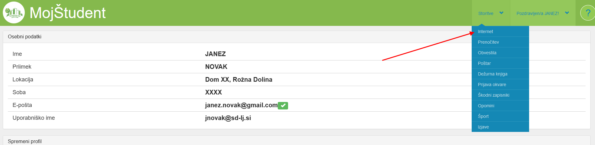
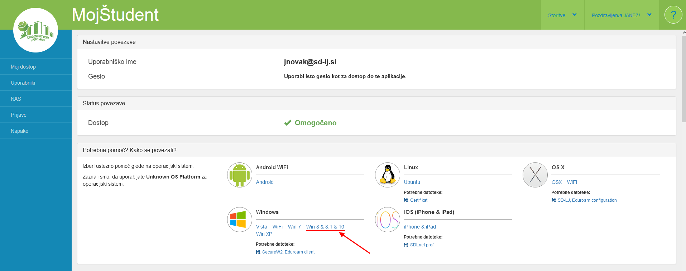

# Nastavitev interneta v ŠDL za Windows 10

Uradna navodila za nastavitev omrežja se nahajajo v aplikaciji [MojŠtudent](https://student.sd-lj.si), v meniju **Storitve > Internet**: 

‼️‼️ **Za dostop do te strani potrebujemo imeti samo priključen kabel!** 
*Tudi če nimamo internetne povezave s svetom, dokler smo s 
kablom priključeni v ŠDL domovih, bo ta stran delovala.*

## Pogoste težave

❓ Za seznam pogostih težav [glej povezavo](./content/FAQ.md).

## Nastavitev interneta

### 1. Nastavitev profila v aplikaciji MojŠtudent

Prvo je potrebno obiskati aplikacijo MojŠtudent (na zgornjem naslovu) in 
se vanjo prijaviti z uporabniškim imenom in geslom, ki ste ju 
dobili ob vselitvi (zapisano na papirju). Ob prvi prijavi vas bo 
aplikacija pozvala, da spremenite svoje geslo, pri čemer bo staro 
geslo postalo neveljavno. Od sedaj naprej je potrebno uporabiti 
podano uporabniško ime in nastavljeno geslo. Z več informacij v zvezi z uporabniškim imenom in geslom, [glej povezavo](./content/Username.md).

‼️‼️ **Ta korak je potrebno storiti, preden želimo nastaviti internet.**

### 2. Namestitev SecureW2 programa

Prvo potrebujemo namestiti **SecureW2** program. Navodila za namestitev programa so opisana [tukaj](./content/SecureW2.md).

### 3. Namestitev omrežja

Ko smo uspešno namestili **SecureW2** program (in ponovno zagnali računalnik), lahko nastavimo žično in brezžično povezavo: 

Izberi ustrezno namestitev:
* [Žična povezava - kabel](./content/Kabel.md)
* [Brezžična povezava - WiFi (PC)](./content/WiFi.md)
* [Brezžična povezava - WiFi (Android)](./content/Android.md)
