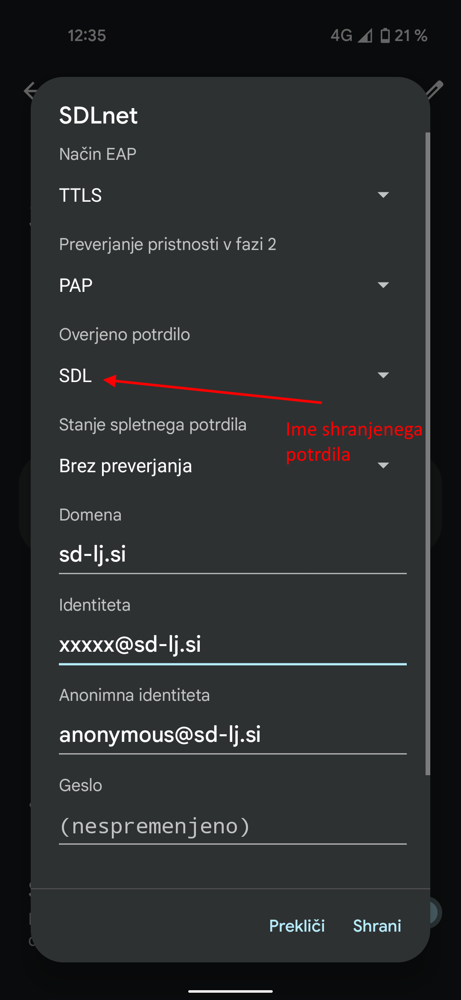

[Domov](../README.md)

# WiFi - Android

Na mobilnih napravah z novejšo rezličico Android, je potrebno nastaviti nekatere dodatne vrednosti, da bo povezava delovala.

1. Najprej je potrebno prenesti Arnesov EduRoam certifikat (datoteka `Arnes CA 2012`) iz njihove spletne strani na svojo mobilno napravo: [povezava](https://www.arnes.si/pomoc-uporabnikom/eduroam/navodila-za-povezavo/#rocno) (sekcija 3. - Ročna konfiguracija Eduroam povezave).

2. Ko je ta datoteka prenesena, jo je potrebno namestiti v hrambo potrdil operacijskega sistema Android ([Primer namestitve potrdila](https://support.google.com/pixelphone/answer/2844832?hl=en)).

3. Po uspešni namestitvi potrdila, izpolnimo nastavitve povezave `SDLnet`:

4. Nastavitve shranimo in se poskusimo povezati na omrežje. 

‼️‼️ Včasih se naprava ne takoj poveže in je potrebno počakati nekaj časa (~24h) (da potečejo predpomnjene nastavitve), preden bo povezava pričela delovati.
