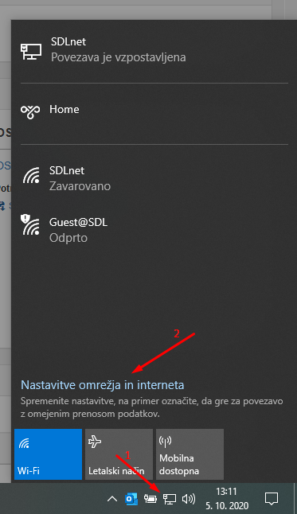
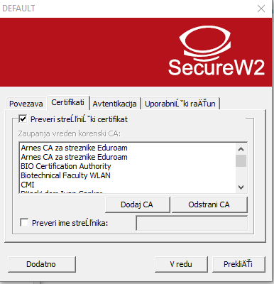

# ŠDL Ethernet (Kabel)

Uradno stališče ŠDL je, da je povezava preko kabla primarna in se smatra, da večina uporabnikov dostopa do interneta preko kabla. Omogočena je tudi uporaba WiFi omrežja, ampak se je potrebno zavedati da je to sekundarni način dostopa do interneta in ni zagotovila, da bo dobro delovalo. Na WiFi se tako lahko zgodi, da se internet precej upočasni, lahko nam pa tudi prekine povezavo in se moramo znova povezati (Pri čemer ponovimo samo 8. točko iz spodnjih navodil).

Priporočeno je, da se ob nastavljanju omrežja uredi tudi povezava preko kabla (če nimate kabla, si ga začasno sposodite od cimra/e, dobite pa ga v vsaki tehnični trgovini pod imenom UTP kabel).

# Nastavitev ŠDL Ethernet (kabel) na Windows 10

1. Najprej opravimo namestitev programa [SecureW2](./SecureW2.md)

2. Odpremo okno za nastavitev interneta

3. Nato izberemo gumb **Spremeni možnosti omrežne kartice** in z desnim klikom kliknemo na vmesnik z imenom **Ethernet**.
V kontekstnem meniju, ki se nam pojavi ob desnem kliku, izberemo možnost **Lastnosti**.

4. Odpremo zavihek **Preverjanje pristnosti** in iz spustnega seznama izberemo možnost **SecureW2: SecureW2 EAP-TTLS**

Nato kliknemo gumb **Nastavitve**, ki je zraven tega spustnega seznama

5. V prvem, drugem in tretjem zavihku, preverimo da so izbrane iste možnosti kot na sliki:

V zadnjem zavihku pa vnesemo naslednje možnosti:
* **Vprašaj uporabnika za geslo**: ne izberemo
* **Uporabniško ime**: Vnesemo svoj ŠDL račun, ki ste ga dobili ob vselitvi. (Račun je v obliki xxxxxx@sd-lj.si, pri čemer je prvi del sestavljen iz imena in priimka.)
* **Geslo**: Geslo je isto kot za MojŠtudent in je isto, kot ste ga nastavili ob prvi prijavi v MojŠtudent. Če prve prijave v MojŠtudent niste še opravili in ste izgubili geslo, je potrebno zaprositi za novo geslo - to se stori lahko samo na upravi.
* **Uporabi ta račun za prijavo**: To možnost izberemo.

6. Internet bi sedaj moral delovati
