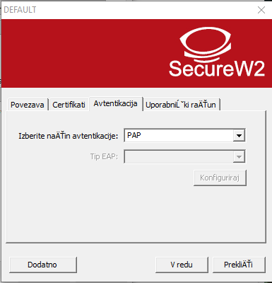
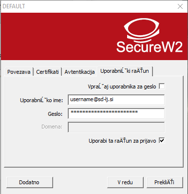

# ŠDL Ethernet (Kabel)

Uradno stališče ŠDL je, da je povezava preko kabla primarna in se smatra, da večina uporabnikov dostopa do interneta preko kabla. Omogočena je tudi uporaba WiFi omrežja, ampak se je potrebno zavedati da je to sekundarni način dostopa do interneta in ni zagotovila, da bo dobro delovalo. Na WiFi se tako lahko zgodi, da se internet precej upočasni, lahko nam pa tudi prekine povezavo in se moramo znova povezati (Pri čemer ponovimo samo 8. točko iz spodnjih navodil).

Priporočeno je, da se ob nastavljanju omrežja uredi tudi povezava preko kabla (če nimate kabla, si ga začasno sposodite od cimra/e, dobite pa ga v vsaki tehnični trgovini pod imenom UTP kabel).

# Nastavitev ŠDL Ethernet (kabel) na Windows 10

OPOZORILO: Ob končani namestitvi bomo morali računalnik ponovno zagnati

1. Najprej prenesemo datoteko Eduroam.exe, ki jo dobimo na strani Internet:

2. Datoteko zaženemo

3. Ko nas vpraša ali shrani geslo, izberemo **Geslo shrani** - V nasprotnem primeru, bomo morali geslo vedno znova vnašati, lahko pa pride tudi do napačnega delovanja. Če se v tem koraku izbere druga možnost, bo potrebno postopek namestitve ponoviti.

4. Izberemo jezik in kliknemo **Naprej**/**Next**

5. Pogoje podrobno preberemo ;) in kliknemo **Se strinjam**/**I agree**

6. Ko nas vpraša katere komponente želimo nastaviti, moramo biti pozorni, da je izbrana možnost **TTLS 4.1.0**

7. Na strani, kjer nas vpraša za uporabniško ime in geslo, navedemo svoje poverilnice (Te podatke pozorno vnesemo, saj so najpogostejši vzrok težav).

8. Računalnik ponovno zaženemo

9. Odpremo okno za nastavitev interneta

10. Nato izberemo gumb **Spremeni možnosti omrežne kartice** in z desnim klikom kliknemo na vmesnik z imenom **Ethernet**.
V kontekstnem meniju, ki se nam pojavi ob desnem kliku, izberemo možnost **Lastnosti**.

11. Odpremo zavihek **Preverjanje pristnosti** in iz spustnega seznama izberemo možnost **SecureW2: SecureW2 EAP-TTLS**

Nato kliknemo gumb **Nastavitve**, ki je zraven tega spustnega seznama

12. V prvem, drugem in tretjem zavihku, preverimo da so izbrane iste možnosti kot na sliki:

V zadnjem zavihku pa vnesemo naslednje možnosti:
* **Vprašaj uporabnika za geslo**: ne izberemo
* **Uporabniško ime**: Vnesemo svoj ŠDL račun, ki ste ga dobili ob vselitvi. (Račun je v obliki Xyyyyy@sd-lj.si, pri čemer je X prva črka imena in yyyyy pet črk priimka.)
* **Geslo**: Geslo je isto kot za MojŠtudent in je isto, kot ste ga nastavili ob prvi prijavi v MojŠtudent. Če prve prijave v MojŠtudent niste še opravili in ste izgubili geslo, je potrebno zaprositi za novo geslo - to se stori lahko samo na upravi.
* **Uporabi ta račun za prijavo**: To možnost izberemo.

13. Internet bi sedaj moral delovati
