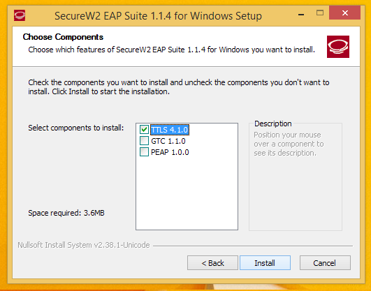

[Domov](../README.md)

# Namestitev programa SecureW2 (Eduroam client)

‼️‼️ **OPOZORILO: Ob končani namestitvi bomo morali računalnik ponovno zagnati**

1. Najprej prenesemo datoteko Eduroam.exe, ki jo 
   dobimo v **Internet** meniju:
   

2. Datoteko zaženemo

3. Ko nas vpraša ali shrani geslo, izberemo **Geslo shrani** – 
   V nasprotnem primeru, bomo morali geslo vedno znova vnašati, 
   lahko pa pride tudi do napačnega delovanja. Če se v tem 
   koraku izbere druga možnost, bo potrebno postopek namestitve ponoviti.

4. Izberemo jezik in kliknemo **Naprej**/**Next**

5. Pogoje podrobno preberemo ;) in kliknemo **Se strinjam**/**I agree**

6. Ko nas vpraša, katere komponente želimo nastaviti,
   moramo biti pozorni, da je izbrana možnost **TTLS 4.1.0** (ostali dve sta za nas nepomembni)

7. Pri koraku, kjer nas vpraša za uporabniško ime in geslo,
   moramo biti pozorni, kaj vnesemo, saj je to najpogostejši vzrok težav. 
   V primeru negotovosti, katero uporabniško ime in geslo je potrebno vnesti, [glej povezavo](./Username.md). 

8. Računalnik ponovno zaženemo

SecureW2 je sedaj nameščen! Sedaj lahko nastavimo žično in/ali brezžično povezavo.
Navodila so na teh povezavah:
* [Žična povezava - kabel](./Kabel.md)
* [Brezžična povezava - WiFi](./WiFi.md)
