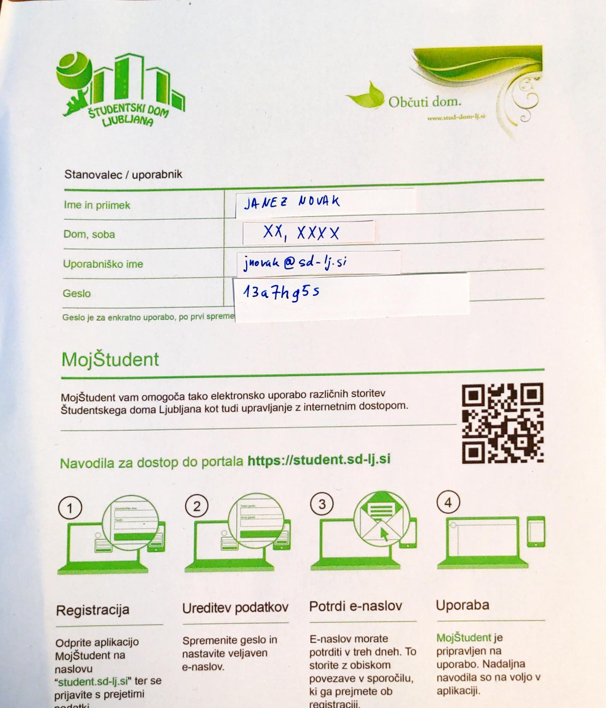
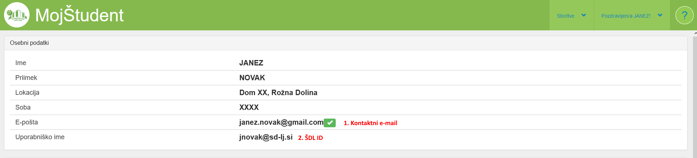

[Domov](../README.md)

# Izbira uporabniškega imena in gesla za prijavo

V aplikaciji MojŠtudent imamo registrirani dve uporabniški imeni: 

* **ŠDL ID**, ki nam je bil dodeljen ob vselitvi (zapisan na papirju, 
  z navodili za internet, dobljen ob vselitvi),
* **Kontaktni e-mail**, katerega smo nastavili ob prvi prijavi v MojŠtudent.

*Papir s podatki, pridobljen ob vselitvi*

V aplikacijo MojŠtudent se lahko prijavimo s kombinacijo kateregakoli 
izmed teh dveh uporabniških imen in nastavljenega gesla. Za nastavitev 
interneta pa se priporoča uporaba ŠDL ID, saj drugače lahko pride do nepredvidenih problemov.

Če nismo prepričani, kakšen je naš ŠDL ID, lahko to vedno preverimo v aplikaciji MojŠtudent:

Pri vnosu ŠDL ID, bodite pozorni na domenski del e-naslova (za znakom `@`),
saj se lahko pri starejših računih (pri tistih, ki so vseljeni 5+ let) ta nekoliko razlikuje.
In sicer, njihova domena ni `xxxxxx@sd-lj.si`, temveč `xxxxxx@sd.uni-lj.si`.

‼️‼️ **To zadnjo domeno, velikokrat SecureW2 samodejno predlaga kot domeno. V primeru, da se ta ne ujema z vašim ŠDL ID, jo je potrebno popraviti!**
