# ŠDL WiFi

Uradno stališče ŠDL je, da je povezava preko kabla primarna in se smatra, 
da večina uporabnikov dostopa do interneta preko kabla. 
Omogočena je tudi uporaba WiFi omrežja, ampak se je potrebno 
zavedati, da je to sekundarni način dostopa do interneta in 
ni zagotovila, da bo dobro delovalo. Na WiFi se tako lahko zgodi, 
da se internet precej upočasni, lahko nam pa tudi prekine povezavo 
in se moramo znova povezati (Pri čemer ponovimo samo 8. točko iz 
spodnjih navodil).

Priporočeno je, da se ob nastavljanju omrežja uredi tudi povezava 
preko kabla (če nimate kabla, si ga začasno sposodite od cimra/e, 
dobite pa ga v vsaki tehnični trgovini pod imenom UTP kabel).

# Nastavitev ŠDL WiFi na Windows 10

1. Odpri zavihek z nastavitvami za internet (spodaj desno) in v 
   njem izberi **Nastavitve omrežja in interneta**.

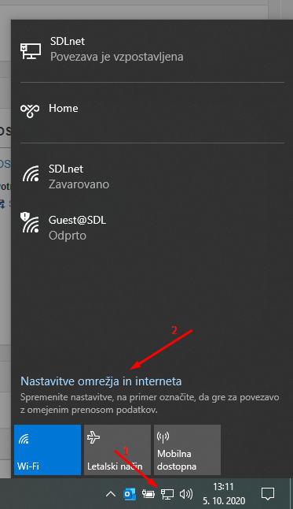

2. V nastavitvah izberi možnost **Stanje** in podrsaj do konca strani. 

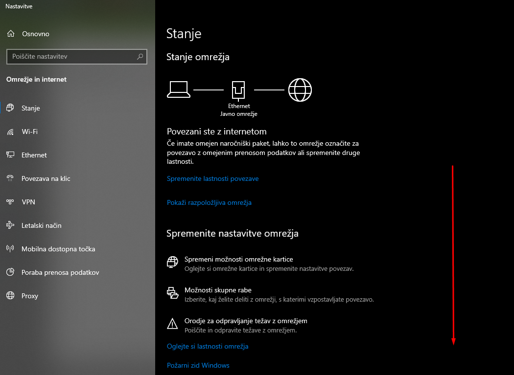

Izberi možnost **Središče za omrežje in skupno rabo** 
(Na različnih verzijah Windows 10 lahko to okno zgleda malo drugače, ime 
potrebne nastavitve ostaja isto).

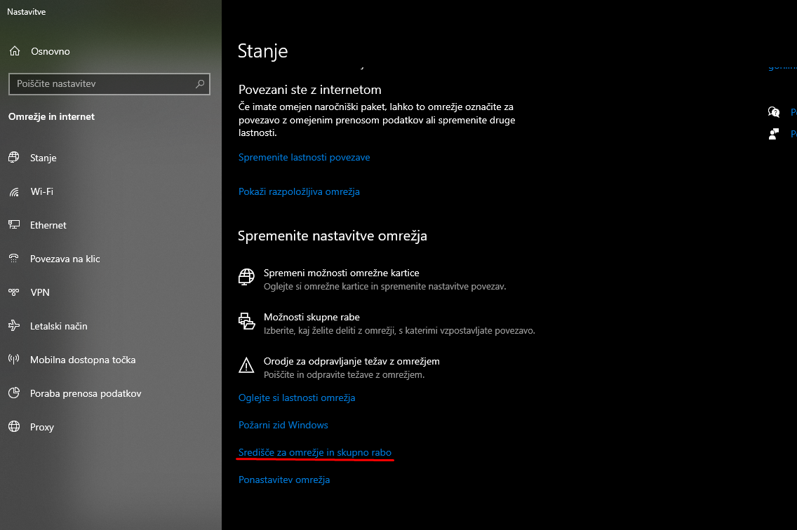

3. Izberi možnost **Namestitev nove povezave ali omrežja**

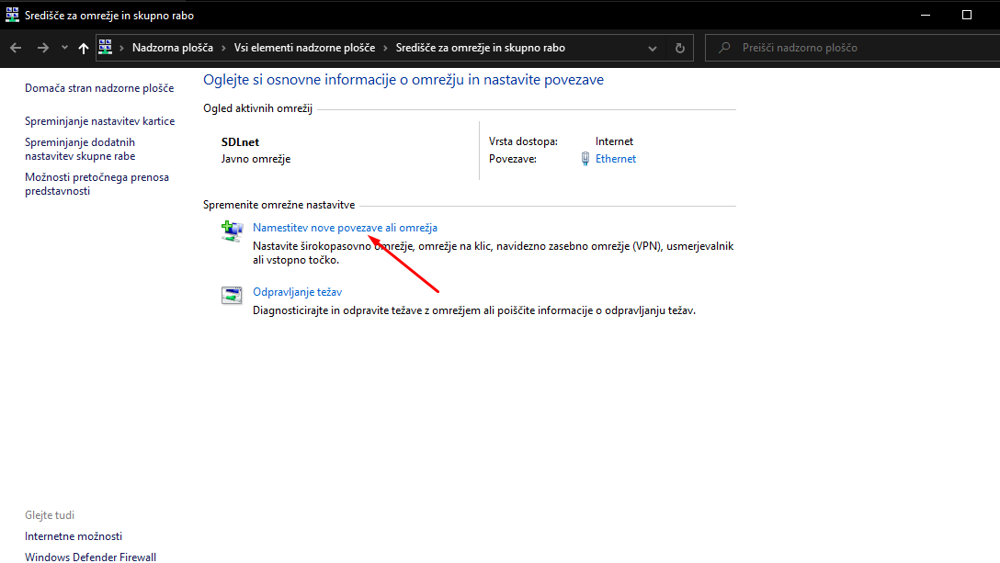

4. Izberi **Ročna povezava z brezžičnim omrežjem**

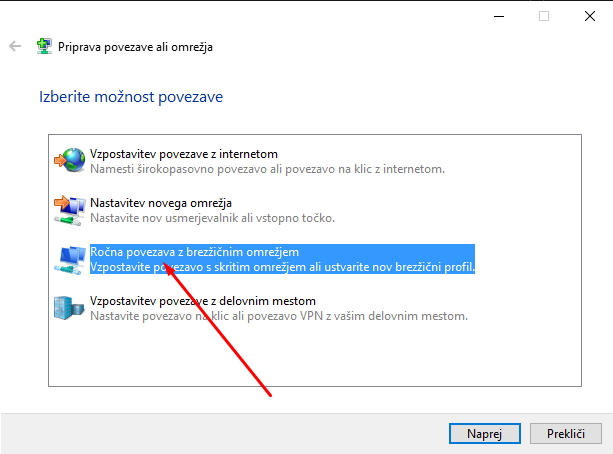

5. Potrebno je vnesti nekaj podatkov:

* **Ime omrežja**: Mora biti točno `SDLnet`, pri čemer je treba biti 
  pozoren na velike/male začetnice.
* **Vrsta varnosti**: Mora biti WPA2 – Podjetniško oz. Enterprise.
* **Vrsta šifriranja**: Mora biti AES (je že privzeta vrednost)
* **Varnostni ključ**: Ostane prazno polje
* **Samodejno zaženi to povezavo**: Ta možnost naj bo izbrana
* **Vzpostavi povezavo, tudi če omrežje ne oddaja**: Pustimo neizbrano

‼️‼️ **POMEMBNO:**
Kliknemo **Naprej**. Ko nas vpraša ali bi radi spremenili nastavitve 
povezave, kliknemo na okvir s tem besedilom, in se nam odpre 
okno, prikazano v točki 6.

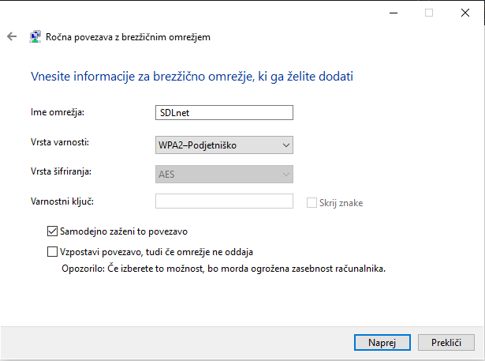

6. V odprtem oknu izberemo zavihek **Varnost** – Če tega zavihka ni, 
   moramo najprej namestiti [SecureW2](./SecureW2.md).

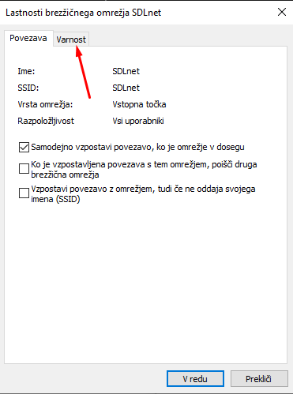

V zavihku varnost nastavimo naslednje vrednosti:

* **Vrsta varnosti**: WPA2 – Podjetniško (oz. Enterprise)
* **Vrsta Šifriranja**: AES
* **Način preverjanja pristnosti v omrežju**: SecureW2: SecureW2 EAP-TTLS
* **Zapomni si poverilnice za to povezavo ob vsaki prijavi**: 
  Izberemo to možnost

Kliknemo na gumb **Nastavitve**.

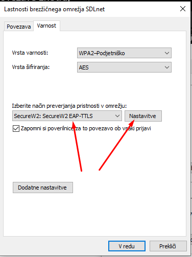

7. Kliknemo na gumb **Konfiguriraj**.

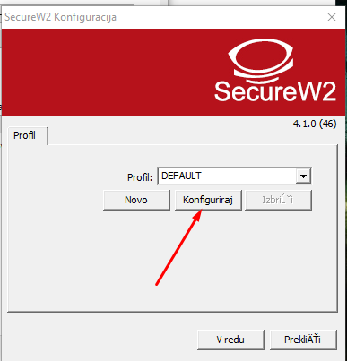

V prvem, drugem in tretjem zavihku, preverimo, da so izbrane iste 
možnosti kot na sliki:

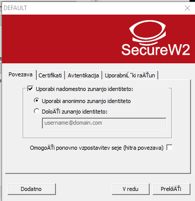

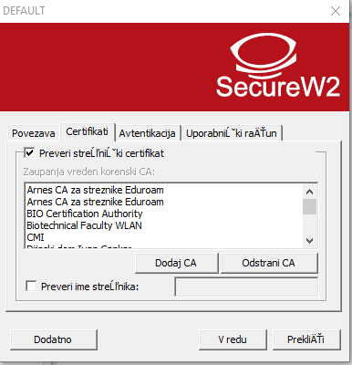

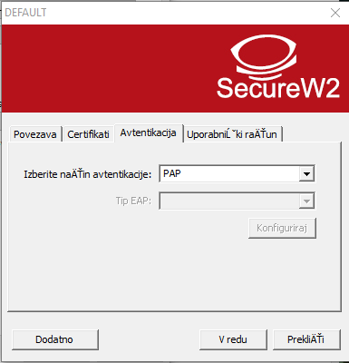

V zadnjem zavihku pa vnesemo naslednje možnosti:
* **Vprašaj uporabnika za geslo**: ne izberemo
* **Uporabniško ime**: Vnesemo svoj ŠDL račun, ki ste ga 
  dobili ob vselitvi. (Račun je v obliki xxxxxx@sd-lj.si, pri 
  čemer je prvi del sestavljen iz imena in priimka,
  [glej povezavo](./Username.md))
* **Geslo**: Geslo je isto kot za MojŠtudent in je isto, 
  kot ste ga nastavili ob prvi prijavi v MojŠtudent. Če 
  prve prijave v MojŠtudent niste še opravili in ste izgubili 
  geslo, je potrebno zaprositi za novo geslo – to se stori 
  lahko samo na upravi.
* **Uporabi ta račun za prijavo**: To možnost izberemo.

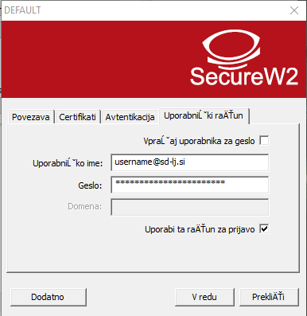

8. Vsa okna lahko sedaj zapremo (S klikom na gumb V redu). Nazaj 
   odpremo wifi okno (gumb spodaj desno, korak ena na prvi sliki) 
   in vzpostavimo povezavo z omrežjem SDLnet. Če vse deluje ok, bi 
   se moralo povezati.
